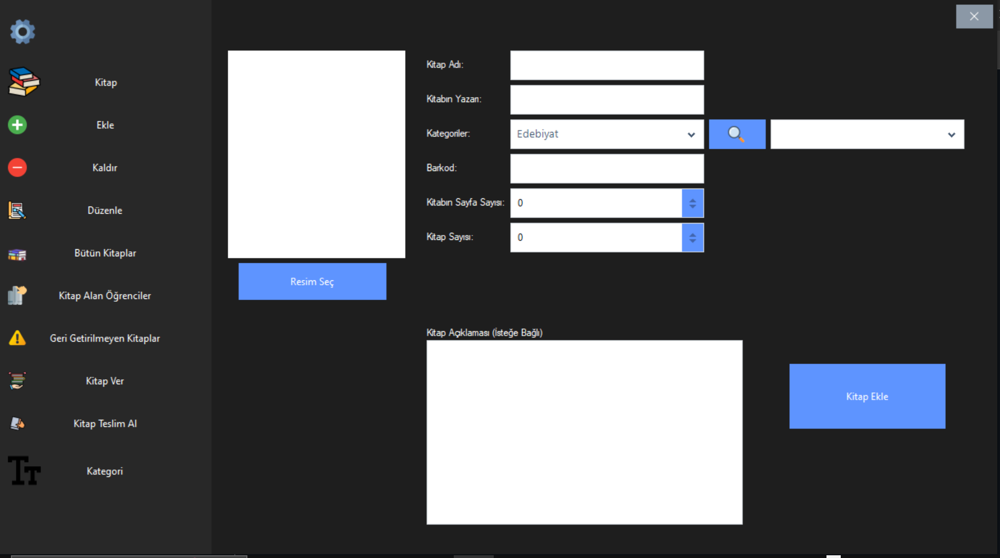

# Kütüphane Yönetim Sistemi

Okul kütüphanesi için geliştirilmiş kitap takip programı.

## Program Özellikleri

- Kitap ekleme, silme ve düzenleme
- Tüm kitapları görüntüleme
- Kitap alan öğrencileri listeleme
- Geri getirilmeyen kitapları takip etme
- Kitap ödünç verme ve teslim alma
- Kategori yönetimi
- Veritabanı yedekleme (Flash belleğe yedek)

## Ekran Görüntüleri

